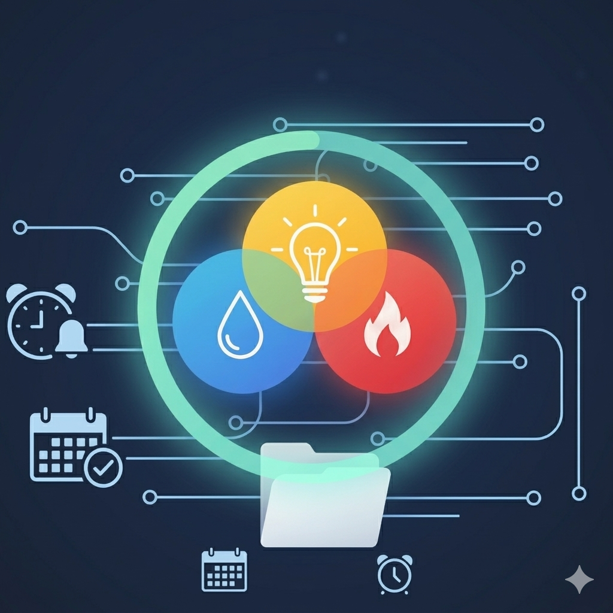

<p align="center">
  
</p>

# Bolletta Sync

Bolletta Sync is a Python-based web service designed to automate the synchronization of utility invoices from various Italian providers to Google Drive and Google Tasks. It uses Playwright for web scraping and the Google API for cloud integration.

## Features

- **Multi-Provider Support**: Automatically fetch invoices from:
  - Fastweb (Fixed line)
  - Fastweb Energia
  - Eni Plenitude (with CAPSolver integration for ReCaptcha)
  - Umbra Acque
- **Google Drive Integration**: Automatically uploads invoice PDFs to Google Drive, organized by year and provider (e.g., `bollette/2025/fastweb/...`).
- **Google Tasks Integration**: Creates tasks for invoice payment deadlines with the due date and amount.
- **REST API**: Simple FastAPI interface to trigger synchronization and check status.
- **Automated Scheduling**: Automatically runs the sync process based on a configurable schedule (requires the application to be running and authenticated).
- **Sync Persistence**: Saves the result of every synchronization (manual or scheduled) to `data/last_sync.json` for easy auditing and status tracking.

## Prerequisites

- **Python 3.13** or higher.
- **Google Cloud Project**: You need a project with the Google Drive API and Google Tasks API enabled.
- **Google Credentials**: A `google_credentials.json` file (**Web application type**) placed in the `data/` folder.
- **CAPSolver API Key**: Required for solving ReCaptcha on the Eni Plenitude portal.

## Installation

1. **Clone the repository**:
   ```bash
   git clone <repository-url>
   cd bolletta_sync
   ```

2. **Install dependencies**:
   ```bash
   poetry install
   ```

3. **Install Playwright Browsers**:
   ```bash
   poetry run playwright install chromium
   ```

## Configuration

The application uses environment variables for configuration. Create a `.env` file in the project root with the following keys:

```env
# General
CAPSOLVER_API_KEY=your_capsolver_key

# Fastweb
FASTWEB_USERNAME=your_username
FASTWEB_PASSWORD=your_password
FASTWEB_CLIENT_CODE=code1,code2  # Comma-separated if multiple

# Fastweb Energia
FASTWEB_ENERGIA_USERNAME=your_username
FASTWEB_ENERGIA_PASSWORD=your_password

# Eni Plenitude
ENI_USERNAME=your_email
ENI_PASSWORD=your_password

# Umbra Acque
UMBRA_ACQUE_USERNAME=your_email
UMBRA_ACQUE_PASSWORD=your_password

# App Mode
DEV_MODE=false

# Security (Optional)
API_KEY=your_secret_api_key

# Schedule (Optional)
SYNC_SCHEDULE="0 0 * * *"  # Crontab expression for automated sync
SYNC_DAYS_OFFSET=10        # Optional: Number of days to look back (default: 10)
```

### Google OAuth2 Setup

1. Go to the [Google Cloud Console](https://console.cloud.google.com/).
2. Create an **OAuth 2.0 Client ID** of type **Web Application**.
3. Add the following to **Authorized redirect URIs**:
   - `http://localhost:8000/auth/callback` (for local development)
   - `https://your-domain.com/auth/callback` (for production)
4. Download the JSON file and rename it to `google_credentials.json` in the `data/` folder.

## Usage

### Start the API Server

Run the server using FastAPI:

```bash
poetry run fastapi dev bolletta_sync/main.py
```

The service will be available at `http://localhost:8000`.

### Authentication Flow

Before running a sync, you must authorize the application:

1. Visit `http://localhost:8000/auth/login`.
2. Complete the Google login process.
3. Once authorized, a `google_token.json` file will be created in the `data/` folder for future sessions.

### Automated Scheduling

The application includes a built-in scheduler. Once the server is started and you have completed the [Authentication Flow](#authentication-flow), the synchronization process will automatically run according to the schedule defined in the `.env` file (variable `SYNC_SCHEDULE`).

It will attempt to sync all providers for the last `SYNC_DAYS_OFFSET` days (defaults to 10). Logs will indicate the progress of these scheduled tasks.

### API Endpoints

If the `API_KEY` environment variable is set, the `/providers` and `/sync` endpoints require the `X-API-Key` header.

- **GET `/`**: Check API status, version, authentication state, and the details of the last synchronization.
- **GET `/auth/login`**: Start the Google OAuth2 flow.
- **GET `/providers`**: List supported providers.
- **POST `/sync`**: Trigger a synchronization process in the background. Returns a 200 status code once the process has been taken over by the server.
  
  **Request Body Example**:
  ```json
  {
    "providers": ["fastweb", "eni"],
    "start_date": "2025-01-01",
    "end_date": "2025-02-01"
  }
  ```
  *If `providers` is omitted, all providers will be synced. `start_date` defaults to `SYNC_DAYS_OFFSET` days ago (default 10), and `end_date` defaults to today.*

## Project Structure

- `bolletta_sync/main.py`: FastAPI application, OAuth2 routes, and entry point.
- `bolletta_sync/sync.py`: Main logic for orchestration and Google credential management.
- `bolletta_sync/providers/`: contains individual scrapers for each utility provider.
  - `base_provider.py`: Abstract class with shared Google Drive/Tasks logic.
- `data/`: contains Google credentials, token files, and the `last_sync.json` report.
